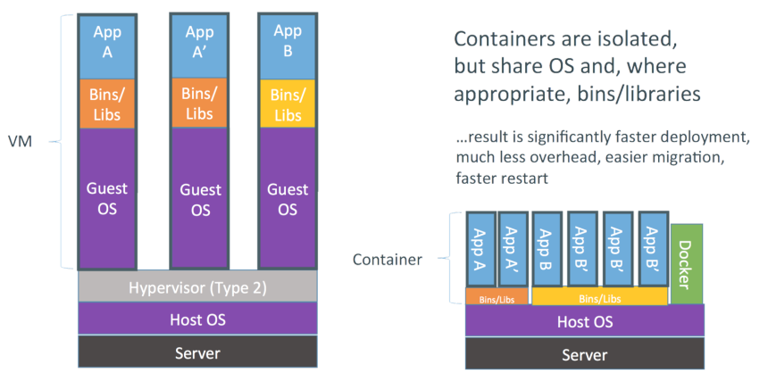
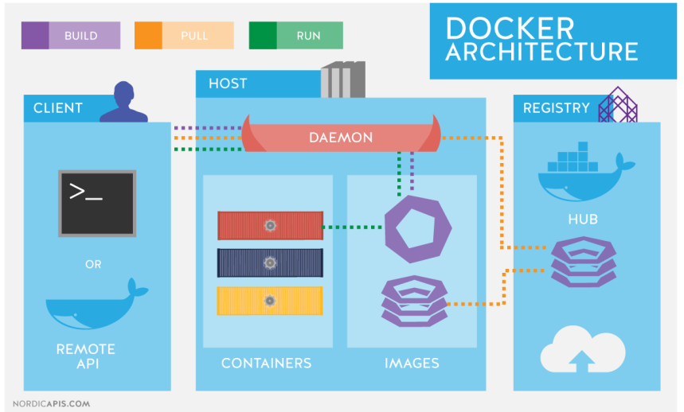
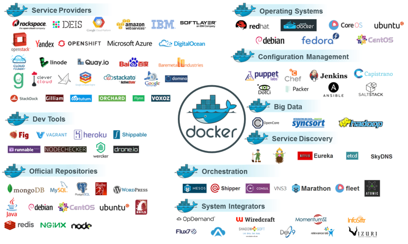
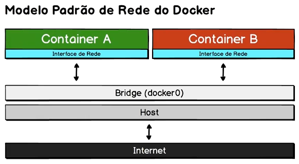
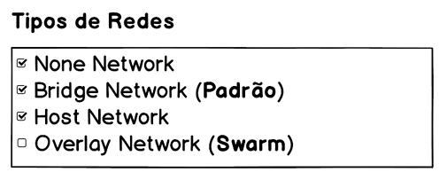

# Docker: Ferramenta essencial para Desenvolvedores

https://www.udemy.com/curso-docker/learn/v4/overview

"No curso você aprenderá os principais conceitos do Docker com vários exercícios práticos, todos descritos detalhadamente na apostila que será disponibilizada no curso. Tudo que for ministrado no curso estará disponível na apostila, e ter esse suporte a mais, será um diferencial fantástico." 

## <a name="indice">Índice</a>

1. [Seção: 1 - Introdução (5)](#parte1)     
2. [Seção: 2 - Conceitos (6)](#parte2)     
3. [Seção: 3 - Instalação (4)](#parte3)     
4. [Seção: 4 - Uso Básico do Docker (14)](#parte4)     
5. [Seção: 5 - Deixando de Ser Apenas um Usuário (11)](#parte5)     
6. [Seção: 6 - Redes (4)](#parte6)     
7. [Seção: 7 - Coordenando Múltiplos Containers (2)](#parte7)     
8. [Seção: 8 - Projeto Cadastro Simples (3)](#parte8)     
9. [Seção: 9 - Projeto para Envio de E-mails com Workers (11)](#parte9)     
---


## <a name="parte1">Seção: 1 - Introdução (5)</a>

- [Mateiral do Curso/Instrutor](https://github.com/josemalcher/curso-docker)

- [PDF do curso](pdf/apostila-docker.pdf)

[Voltar ao Índice](#indice)

---


## <a name="parte2"> Seção: 2 - Conceitos (6)</a>

#### 1.1. O que é Docker?

É uma ferramenta que se apoia em recursos existentes no kernel, inicialmente Linux, para isolar a execução de processos. As ferramentas que o Docker traz são basicamente uma camada de administração de containers, baseado originalmente no LXC.

Alguns isolamentos possíveis:
- Limites de uso de memória
- Limites de uso de CPU
- Limites de uso de I/O
- Limites de uso de rede
- Isolamento da rede (que redes e portas são acessíveis)
- Isolamento do file system
- Permissões e Políticas
- Capacidades do kernel

Podemos concluir dizendo que estes recursos já existiam no kernel a um certo tempo, o que o Docker nos trouxe foi uma maneira simples e efetiva de utiliza-los.
- https://www.docker.com/what-docker

Containers Docker empacotam componentes de software em um sistema de arquivos completo, que contêm tudo necessário para a execução: código, runtime, ferramentas de sistema - qualquer coisa que possa ser instalada em um servidor.

Isto garante que o software sempre irá executar da mesma forma, independente do seu ambiente.

#### 1.2. Por que não uma VM?

O Docker tende a utilizar menos recursos que uma VM tradicional, um dos motivos é não precisar de uma pilha completa como vemos em Comparação VMs × Containers. O Docker utiliza o mesmo
kernel do host, e ainda pode compartilhar bibliotecas.

Mesmo utilizando o mesmo kernel é possível utilizar outra distribuição com versões diferentes das bibliotecas e aplicativos.



Figura 1. Comparação VMs × Containers

Virtual Machine (máquina virtual), recurso extremamente usado atualmente para isolamento de serviços, replicação e melhor aproveitamento do poder de processamente de uma máquina física.

Devo trocar então minha VM por um container? Nem sempre, os containers Docker possuem algumas limitações em relação as VMs:
- Todas as imagens são linux, apesar do host poder ser qualquer SO que use ou emule um kernel linux, as imagens em si serão baseadas em linux.
- Não é possível usar um kernel diferente do host, o Docker Engine estará executando sob uma determinada versão (ou emulação) do kernel linux, e não é possível executar uma versão diferente, pois as imagens não possuem kernel.

#### 1.3. O que são containers?

Container é o nome dado para a segregação de processos no mesmo kernel, de forma que o processo seja isolado o máximo possível de todo o resto do ambiente.

Em termos práticos são File Systems, criados a partir de uma "imagem" e que podem possuir também algumas características próprias.


- https://www.docker.com/what-container


#### 1.4. O que são imagens Docker?

Uma imagem Docker é a materialização de um modelo de um sistema de arquivos, modelo este produzido através de um processo chamado build.

Esta imagem é representada por um ou mais arquivos e pode ser armazenada em um repositório.

**Docker File Systems**

O Docker utiliza file systems especiais para otimizar o uso, transferência e armazenamento das imagens, containers e volumes.

O principal é o AUFS, que armazena os dados em camadas sobrepostas, e somente a camada mais recente é gravável.
- https://pt.wikipedia.org/wiki/Aufs
- https://docs.docker.com/engine/userguide/storagedriver/aufs-driver/


#### 1.5. Arquitetura

De maneira simplificada podemos dizer que o uso mais básico do Docker consiste em:
- Ter o serviço Docker Engine rodando
- Ter acesso a API Rest do Docker Engine, normalmente através do Docker Client
- Baixar uma imagem do Docker Registry, normalmente do registry público oficial: https://hub.docker.com
- Instanciar um container a partir da imagem baixada



Figura 2. Arquitetura do Docker


#### 1.6. Crescimento do Docker

A primeira versão do Docker é de 13 de março de 2013, tendo um pouco mais de 4 anos (na epóca que este curso foi escrito).

Nestes 4 anos ele tem se tornado cada vez mais popular e uma solução real para desenvolvedores (manter o seu ambiente mais simples e próximo à produção), administradores de sistema e ultimamente para uso enterprise, sendo avaliado pelos principais players do mercado uma alternativa mais econômica em relação as soluções atuais. Em sua maioria virtualização.



[Voltar ao Índice](#indice)

---


## <a name="parte3"> Seção: 3 - Instalação (4)</a>

#### 2.1. Docker Engine e Docker Machine

- Instalação (Linux, Microsoft Windows e MacOS)
- Uso do Docker Machine
- Uso do Docker na nuvem, Amazon, possivelmente outros

[Voltar ao Índice](#indice)

---


## <a name="parte4"> Seção: 4 - Uso Básico do Docker (14)</a>

#### 3.1. Introdução ao Docker Client

Conforme vimos em Arquitetura, o Docker Engine expõe uma API Rest que pode ser consumida pelas mais diversas ferramentas. A ferramenta inicial fornecida com a própria engine é o Docker Client, utilitário de linha de comando.

#### 3.2. Hello World: Meu Docker funciona !

Vamos confirmar o funcionamento do nosso Docker.

```
# docker container run hello-world

Hello from Docker!
This message shows that your installation appears to be working correctly.

To generate this message, Docker took the following steps:
 1. The Docker client contacted the Docker daemon.
 2. The Docker daemon pulled the "hello-world" image from the Docker Hub.
    (amd64)
 3. The Docker daemon created a new container from that image which runs the
    executable that produces the output you are currently reading.
 4. The Docker daemon streamed that output to the Docker client, which sent it
    to your terminal.

To try something more ambitious, you can run an Ubuntu container with:
 $ docker run -it ubuntu bash

Share images, automate workflows, and more with a free Docker ID:
 https://hub.docker.com/

For more examples and ideas, visit:
 https://docs.docker.com/get-started/

```

Na documentação oficial, o passo para verificação da instalação é este Hello World, porém até a publicação deste curso a documentação ainda utilizava a sintaxe antiga: docker run hello-world
- https://docs.docker.com/engine/getstarted/step_one/#step-3-verify-your-installation

Testar correto funcionamento do Docker, incluindo a recuperação de imagens e execução de containers.

#### 3.3. Meu querido amigo run

O comando run é a nossa porta de entrada no Docker, agrupando diversas funcionalidades básicas, como:
- Download automático das imagens não encontradas: docker image pull
- Criação do container: docker container create
- Execução do container: docker container start
- Uso do modo interativo: docker container exec

A partir da versão 1.13, o Docker reestruturou toda a interface da linha de comando, para agrupar melhor os comandos por contexto.

Apesar dos comandos antigos continuarem válidos, o conselho geral é adotar a nova sintaxe.
- https://blog.docker.com/2017/01/whats-new-in-docker-1-13/#h.yuluxi90h1om

Até a versão 17.03 (corrente na publicação do curso), ainda é possível utilizarmos a sintaxe antiga, porém precisamos pensar nela como atalhos:

```
docker pull
    docker image pull
docker create
    docker container create
docker start
    docker container start
docker exec
    docker container exec
```


#### 3.4. Modo interativo

Podemos usar containers em modo interativo, isto é extremamente útil para processos experimentais, estudo dinâmico de ferramentas e de desenvolvimento.

Exemplos de Uso
- Avaliação do comportamento ou sintaxe de uma versão específica de linguagem.
- Execução temporária de uma distribuição linux diferente
- Execução manual de um script numa versão diferente de um interpretador que não a instalada no host.

Principais opções do Docker para este fim
- docker container run -it
- docker container start -ai
- docker container exec -t

Exercício 2 - Ferramentas diferentes

```
# bash --version
GNU bash, versão 5.0.7(1)-release (x86_64-redhat-linux-gnu)
Copyright (C) 2019 Free Software Foundation, Inc.
Licença GPLv3+: GNU GPL versão 3 ou posterior <http://gnu.org/licenses/gpl.html>.

Este é um software livre; você é livre para alterar e redistribuí-lo.
Há NENHUMA GARANTIA, na extensão permitida pela lei.


# docker container run debian bash --version
Unable to find image 'debian:latest' locally
Trying to pull repository docker.io/library/debian ... 
sha256:75f7d0590b45561bfa443abad0b3e0f86e2811b1fc176f786cd30eb078d1846f: Pulling from docker.io/library/debian
c5e155d5a1d1: Pull complete 
Digest: sha256:75f7d0590b45561bfa443abad0b3e0f86e2811b1fc176f786cd30eb078d1846f
Status: Downloaded newer image for docker.io/debian:latest
GNU bash, version 4.4.12(1)-release (x86_64-pc-linux-gnu)
Copyright (C) 2016 Free Software Foundation, Inc.
License GPLv3+: GNU GPL version 3 or later <http://gnu.org/licenses/gpl.html>

This is free software; you are free to change and redistribute it.
There is NO WARRANTY, to the extent permitted by law.

```

Confirmar que o conjunto de ferramentas disponíveis em um container são diferentes das disponíveis no host.

**Exercício 3 - run cria sempre novos containers**

```
#  docker container run -it debian bash
root@24ec893de712:/# touch /curso-docker.txt
root@24ec893de712:/# exit
exit

# docker container run -it debian bash
root@fc8c3355fa81:/# ls

root@fc8c3355fa81:/# ls /curso-docker.txt
ls: cannot access '/curso-docker.txt': No such file or directory

```

Demonstrar que o run sempre irá instanciar um novo container.
Como vimos em Docker File Systems, o container e a imagem são armazenados em camadas, o processo de instanciar um container basicamente cria uma nova camada sobre a imagem existente, para que nessa camada as alterações sejam aplicadas.

Assim sendo o consumo de espaço em disco para instanciar novos containers é relativamente muito baixo.

**Exercício 4 - Containers devem ter nomes únicos**

```
# docker container run --name mydeb -it debian bash
root@dbfa23d826d1:/# exit
exit

# docker container run --name mydeb -it debian bash
/usr/bin/docker-current: Error response from daemon: Conflict. The container name "/mydeb" is already in use by container dbfa23d826d1271ae33c91fe5abfdd4235dbf50869e84338c56e6ae3d9680e66. You have to remove (or rename) that container to be able to reuse that name..
See '/usr/bin/docker-current run --help'.

```

**Exercício 5 - Reutilizar containers**

```
# docker container start -ai mydeb
root@dbfa23d826d1:/# ls   
bin  boot  dev	etc  home  lib	lib64  media  mnt  opt	proc  root  run  sbin  srv  sys  tmp  usr  var
root@dbfa23d826d1:/# touch /curso-docker.txt
root@dbfa23d826d1:/# ls
bin  boot  curso-docker.txt  dev  etc  home  lib  lib64  media	mnt  opt  proc	root  run  sbin  srv  sys  tmp	usr  var
root@dbfa23d826d1:/# exit
exit

# docker container start -ai mydeb
root@dbfa23d826d1:/# ls /curso-docker.txt 
/curso-docker.txt
root@dbfa23d826d1:/# exit
exit

```

Demonstrar o uso do start em modo interativo, reutilizando um container previamente criado, além de confirmar que o mesmo consegue reter modificações em seu file system.

**Remover depois que executar (não salav na lista de containers) -> --rm**

```
# docker container ps -a
CONTAINER ID        IMAGE               COMMAND             CREATED             STATUS                      PORTS               NAMES
dbfa23d826d1        debian              "bash"              5 minutes ago       Exited (0) 2 minutes ago                        mydeb
fc8c3355fa81        debian              "bash"              8 minutes ago       Exited (2) 6 minutes ago                        gallant_mayer
24ec893de712        debian              "bash"              8 minutes ago       Exited (0) 8 minutes ago                        gallant_stallman
24fd2d69e6b0        debian              "bash --version"    16 minutes ago      Exited (0) 16 minutes ago                       naughty_curie

# docker container run --rm debian bash --version
GNU bash, version 4.4.12(1)-release (x86_64-pc-linux-gnu)
Copyright (C) 2016 Free Software Foundation, Inc.
License GPLv3+: GNU GPL version 3 or later <http://gnu.org/licenses/gpl.html>

This is free software; you are free to change and redistribute it.
There is NO WARRANTY, to the extent permitted by law.

# docker container ps -a
CONTAINER ID        IMAGE               COMMAND             CREATED             STATUS                         PORTS               NAMES
dbfa23d826d1        debian              "bash"              6 minutes ago       Exited (0) 3 minutes ago                           mydeb
fc8c3355fa81        debian              "bash"              8 minutes ago       Exited (2) 6 minutes ago                           gallant_mayer
24ec893de712        debian              "bash"              8 minutes ago       Exited (0) 8 minutes ago                           gallant_stallman
24fd2d69e6b0        debian              "bash --version"    17 minutes ago      Exited (0) 17 minutes ago                          naughty_curie


```

#### 3.5. Cego, surdo e mudo, só que não !

Um container normalmente roda com o máximo de isolamento possível do host, este isolamento é possível através do Docker Engine e diversas características provídas pelo kernel.

Mas normalmente não queremos um isolamento total, e sim um isolamento controlado, em que os recursos que o container terá acesso são explicitamente indicados. Principais recursos de controle do isolamento
- Mapeamento de portas
- Mapeamento de volumes
- Copia de arquivos para o container ou a partir do container
- Comunicação entre os containers

#### 3.5.1. Mapeamento de portas

É possível mapear tanto portas TCP como UDP diretamente para o host, permitindo acesso através de toda a rede, não necessitando ser a mesma porta do container. O método mais comum para este fim é o parâmetro -p no comando docker container run, o -p recebe um parâmetro que normalmente é composto por dois números separados por : (dois pontos). O primeiro é no host e o segundo é no container

```
# docker container run -p 8080:80 nginx
172.17.0.1 - - [26/May/2019:02:31:00 +0000] "GET / HTTP/1.1" 200 612 "-" "Mozilla/5.0 (X11; Fedora; Linux x86_64) AppleWebKit/537.36 (KHTML, like Gecko) Chrome/74.0.3729.169 Safari/537.36" "-"
2019/05/26 02:31:01 [error] 9#9: *1 open() "/usr/share/nginx/html/favicon.ico" failed (2: No such file or directory), client: 172.17.0.1, server: localhost, request: "GET /favicon.ico HTTP/1.1", host: "localhost:8080", referrer: "http://localhost:8080/"
172.17.0.1 - - [26/May/2019:02:31:01 +0000] "GET /favicon.ico HTTP/1.1" 404 556 "http://localhost:8080/" "Mozilla/5.0 (X11; Fedora; Linux x86_64) AppleWebKit/537.36 (KHTML, like Gecko) Chrome/74.0.3729.169 Safari/537.36" "-"

```

Mapeamento de portas
- Acessar a url http://localhost:8080 por um browser
- Receber a mensagem: Welcome to nginx no browser
- Verificar o log de acesso no terminal executando
- Tentar acessar a url http://localhost ou http://localhost:80
- Receber um erro do browser
- Parar a execução do container

#### 3.5.2. Mapeamento de volumes

É possível mapear tanto diretórios no host como entidades especiais conhecidas como volumes para diretórios no container. Por enquanto vamos nos concentrar no mapeamento mais simples, uma diretório no host para um diretório no container. O método mais comum para este fim é o parâmetro -v no comando docker container run, o -v recebe um parâmetro que normalmente é composto por dois caminhos absolutos separados por : (dois pontos). Assim como diversos outros parâmetros, o primeiro é no host e o segundo é no container.

**Exercício 7 - Mapear diretórios para o container**

```
# docker container run -p 8080:80 -v $(pwd)/html:/usr/share/nginx/html nginx
2019/05/26 02:44:49 [error] 9#9: *2 "/usr/share/nginx/html/index.html" is forbidden (13: Permission denied), client: 172.17.0.1, server: localhost, request: "GET / HTTP/1.1", host: "localhost:8080"
172.17.0.1 - - [26/May/2019:02:44:49 +0000] "GET / HTTP/1.1" 403 556 "-" "Mozilla/5.0 (X11; Fedora; Linux x86_64) AppleWebKit/537.36 (KHTML, like Gecko) Chrome/74.0.3729.169 Safari/537.36" "-"

# docker container run -p 8080:80 -v $(pwd)/html:/usr/share/nginx/html:Z nginx
172.17.0.1 - - [26/May/2019:02:46:37 +0000] "GET / HTTP/1.1" 200 287 "-" "Mozilla/5.0 (X11; Fedora; Linux x86_64) AppleWebKit/537.36 (KHTML, like Gecko) Chrome/74.0.3729.169 Safari/537.36" "-"

```

*(:Z dá permissão de escrita a pasta) 👈

Mapeamento de volumes
- Executar o run.sh
- Acessar a url http://localhost:8080 por um browser
- Receber o erro: 403 Forbidden
- Verificar o log de acesso no terminal executando
- Parar a execução do container
- Executar o run-alt.sh (que mapea o diretório com o index.html)
- Tentar acessar a url http://localhost:8080
- Receber o texto: Hello World
- Bônus: Editar o html/index.html a partir de um editor de textos e atualizar o browser
- Parar a execução do container


#### 3.6. Modo daemon

Agora sim, aonde o Docker começa a brilhar!

Antes de conhecer opções mais avançadas de compartilhamento de recursos, isolamento, etc, precisamos entender como rodar os containers em background. O parâmetro -d do docker container run indica ao Docker para iniciar o container em background (modo daemon).

Para entender melhor estes containers precisaremos conhecer um novo comando: docker container ps, que lista containers em execução.

**Exercício 8 - Rodar um servidor web em background**

```
# docker container run -d --name ex-daemon-basic -p 8080:80 -v $(pwd)/html:/usr/share/nginx/html:Z nginx
36ca7752d1a28148a3ae8be8aa246b40d3223214123123123123121230ff1450fc17
# 

ex-daemon-basic,nginx
Up 28 seconds, PORTA: 0.0.0.0:8080->80/tcp

# docker container stop ex-daemon-basic 
ex-daemon-basic

```

Execução em background
- Levanta o container em background
- Tentar acessar a url http://localhost:8080 via browser
- Receber o texto: Hello World
- Verificar os containers em execução

**Exercício 9 - Gerenciar o container em background**

```
# docker container restart ex-daemon-basic

# docker container stop ex-daemon-basic

# docker container start ex-daemon-basic
```

Reiniciar, parar e iniciar
- Reinicia o container e verifica que acabou de iniciar pelo tempo do status
- Para o container e através do docker container ps vemos que não está mais em execução
- Podemos também tentar acessar pelo browser a url http://localhost:8080, confirmando que não responde mais
- Inicia novamente o container, um observação importante é que não é mais necessário configurar os mapeamentos
- Verificar os containers em execução, também é possível confirmar a execução pelo browser.


#### 3.7. Manipulação de containers em modo daemon

Existem diversos comandos que nos ajuda a acompanhar a execução dos containers, entre eles:
- docker container ls
- docker container ls -a
- docker container inspect
- docker container exec
- docker container logs

Vários comandos Docker possuem aliases, por exemplo o container ls tem os seguintes apelidos:
- docker container list
- docker container ps
- docker ps (antiga sintaxe)


#### 3.8. Nova sintaxe do Docker Client

Agora que já vimos diversos comandos, incluindo tanto a sintaxe nova quanto a velha, podemos entender os principais motivos para esta mudança e a preferência pela nova sintaxe:
- Melhor utilização de comandos similares em contextos diferentes:
  - docker container ls
  - docker image ls
  - docker volume ls
- Maior clareza nos comandos:
  - docker container rm ao invés de docker rm
  - docker image rm ao inveś de docker rmi
  - docker image ls ao invés de docker images
- Mais simplicidade para criação de novos subcomandos
 - Segregação da documentação e helps por contexto


[Voltar ao Índice](#indice)

---


## <a name="parte5"> Seção: 5 - Deixando de Ser Apenas um Usuário (11)</a>

#### 4.1. Introdução

Agora vamos ao conceitos necessários para deixar de apenas utilizar imagens prontas e começar a produzir nossas próprias imagens.

Exemplos de uso
- DevOps - Imagens para processos de integração contínua
- Portabilidade - Imagens de aplicação para ser utilizada em todos os ambientes (staging, prodution, etc)
- Desenvolvimento - Imagens que aproximam todos os devs do ambiente de produção e diminuem a curva de entrada de novos membros
- Imagens customizadas a partir de imagens públicas

#### 4.2. Diferenças entre container e imagem

Utilizando uma analogia com OOP, podemos comparar um container a um objeto (instância), enquanto a imagem seria uma classe (modelo).

Todos os subcomandos relativos ao container podem ser listados através do parâmetro --help, bem como imagens:
- docker container --help
- docker image --help

#### 4.3. Entendendo melhor as imagens

Toda imagem (bem como os containers) possuem um identificador único em formato hash usando sha256. Porém seu uso não é muito prático, então para simplificar isto o docker utiliza uma tag para identificar imagens.

A tag normalmente é formada por um nome, seguido de : dois pontos e depois uma versão. É extremamente comum utilizar uma versão chamada latest para representar a versão mais atual.

Exemplos de tags de imagens:
- nginx:latest
- redis:3.2
- redis:3
- postgres:9.5

Na prática uma tag é apenas um ponteiro para o hash da imagem, e várias tags podem apontar para o mesmo hash. Com isto é comum o uso de alguns apelidos nas tags, tomando como exemplo as imagens oficiais do redis. Existem 10 imagens e 30 tags.

Tags do redis

- 3.0.7, 3.0
- 3.0.7-32bit, 3.0-32bit
- 3.0.7-alpine, 3.0-alpine
- 3.0.504-windowsservercore, 3.0-windowsservercore
- 3.0.504-nanoserver, 3.0-nanoserver
- 3.2.8, 3.2, 3, latest
- 3.2.8-32bit, 3.2-32bit, 3-32bit, 32bit
- 3.2.8-alpine, 3.2-alpine, 3-alpine, alpine
- 3.2.100-windowsservercore, 3.2-windowsservercore
- 3-windowsservercore, windowsservercore
- 3.2.100-nanoserver, 3.2-nanoserver, 3-nanoserver, nanoserver

fonte: https://hub.docker.com/_/redis/

```
# docker image pull redis:latest
Trying to pull repository docker.io/library/redis ... 
sha256:e549a30b3c31e6305b973e0d9113a3d38d60566708137af9ed7cbdce5650c5cc: Pulling from docker.io/library/redis
743f2d6c1f65: Pull complete 
171658c5966d: Pull complete 
fbef10bd7a65: Pull complete 
0b0b11956c72: Pull complete 
09dbd716637e: Pull complete 
d09046fd4481: Pull complete 
Digest: sha256:e549a30b3c31e6305b973e0d9113a3d38d60566708137af9ed7cbdce5650c5cc
Status: Downloaded newer image for docker.io/redis:latest

# docker image ls
REPOSITORY                           TAG                 IMAGE ID            CREATED             SIZE
docker.io/redis                      latest              d3e3588af517        10 days ago         95 MB

# docker image tag redis:latest redis-jose

# docker image ls
REPOSITORY                           TAG                 IMAGE ID            CREATED             SIZE
docker.io/redis                      latest              d3e3588af517        10 days ago         95 MB
redis-jose                           latest              d3e3588af517        10 days ago         95 MB

# docker image rm redis:latest redis-jose
Untagged: redis:latest
Untagged: docker.io/redis@sha256:e549ffffb3c31e6305b973e0d9113a3d38d60566708137af9ed7cbdce5650c5cc
Untagged: redis-jose:latest
Deleted: sha256:d3e3588af5178bae2c8ffdbfa227c7d0305518d3feqfqef7164ffb8643d7eb3
Deleted: sha256:e656b2d3b419e019f3ac97b0b46b35b75e60aaqefqef313cb560b8dd1be8df2
Deleted: sha256:7a0576dc1895efb075766a491594b5c7bd29893dd42f6d69f79c266529f9ba6
Deleted: sha256:2f79381c5bdf1189fcbc505345ef3e8bf5495cfeqf41657feqa57ed06011f96
Deleted: sha256:facd22a9cbc6c62bb80128ec90e784db55447fc444011061edf45675bc0e0e7
Deleted: sha256:009c5bef3a79894d370a2a73a6ce2c24bbe843dabf36572a6ef29c30420894f
Deleted: sha256:6270adb5794c6987109e54af00ab456977c5d5cc6f1bc52cce58d32ec0f15f4
```

#### 4.4. Comandos básicos no gerenciamento de imagens

Já usamos de maneira implícita o recurso de download de imagens docker, agora vamos entender melhor o gerenciamento de imagens.

**docker image pull <tag>**  
Baixa a imagem solicitada, este comando pode ser executado implicitamente, quando o docker precisa de uma imagem para outra operação e não consegue localiza-la no cache local.

**docker image ls**  
Lista todas as imagens já baixadas, é possível ainda usar a sintaxe antiga: docker images

**docker image rm <tag>**  
Remove uma imagem do cache local, é possível ainda usar a sintaxe antiga: docker rmi <tag>

**docker image inspect <tag>**  
Extrai diversas informações utilizando um formato JSON da imagem indicada.

**docker image tag <source> <tag>**  
Cria uma nova tag baseada em uma tag anterior ou hash.

**docker image build -t <tag>**  
Permite a criação de uma nova imagem, como veremos melhor em build.

**docker image push <tag>**  
Permite o envio de uma imagem ou tag local para um registry.

#### 4.5. Docker Hub × Docker Registry

**Docker Registry**  
É uma aplicação server side para guardar e distribuir imagens Docker. 

**Docker Hub**  
É uma serviço de registro de imagens Docker em nuvem, que permite a associação com repositórios para build automatizado de imagens. Imagens marcadas como oficiais no Docker Hub, são criadas pela própria Docker Inc. E o código fonte pode ser encontrado em:
- https://github.com/docker-library

A linha de comando possui o comando docker search <tag> para procurar imagens no Docker Hub.

#### 4.6. Construção de uma imagem

Processo para gerar uma nova imagem a partir de um arquivo de instruções. O comando docker build é o responsável por ler um Dockerfile e produzir uma nova imagem Docker.

**Dockerfile**  
Nome default para o arquivo com instruções para o build de imagens Docker. Documentação do Dockerfile — https://docs.docker.com/engine/reference/builder

```
# docker image build -t ex-simple-build .
Sending build context to Docker daemon 2.048 kB
Step 1/2 : FROM nginx:1.13
Trying to pull repository docker.io/library/nginx ... 
sha256:b1d09e9718890e6ebbbd2bc319ef1611559e30ce1b6f56b2e3b479d9da51dc35: Pulling from docker.io/library/nginx
f2aa67a397c4: Pull complete 
3c091c23e29d: Pull complete 
4a99993b8636: Pull complete 
Digest: sha256:b1d09e9718890e6ebbbd2bc319ef1611559e30ce1b6f56b2e3b479d9da51dc35
Status: Downloaded newer image for docker.io/nginx:1.13
 ---> ae513a47849c
Step 2/2 : RUN echo '<h1>Hello World !</h1>' > /usr/share/nginx/html/index.html
 ---> Running in 65d04840a156
 ---> 74f08697b0a1
Removing intermediate container 65d04840a156
Successfully built 74f08697b0a1

# docker image ls
REPOSITORY                           TAG                 IMAGE ID            CREATED             SIZE
ex-simple-build                      latest              74f08697b0a1        17 seconds ago      109 MB

# docker container run -p 8080:80 ex-simple-build
172.17.0.1 - - [26/May/2019:11:55:31 +0000] "GET / HTTP/1.1" 200 23 "-" "Mozilla/5.0 (X11; Fedora; Linux x86_64) AppleWebKit/537.36 (KHTML, like Gecko) Chrome/74.0.3729.169 Safari/537.36" "-"

```

Exemplo básico de um build e sua execução.

O comando build exige a informação do diretório aonde o build será executado bem como aonde o arquivo de instruções se encontra

#### 4.7. Instruções para a preparação da imagem

**FROM**  
Especifica a imagem base a ser utilizada pela nova imagem.

**LABEL**  
Especifica vários metadados para a imagem como o mantenedor. A especificação do mantenedor era feita usando a instrução específica, MAINTAINER que foi substituída pelo LABEL.

**ENV**  
Especifica variáveis de ambiente a serem utilizadas durante o build.

**ARG**  
Define argumentos que poderão ser informados ao build através do parâmetro --build-arg.

```
FROM debian
LABEL maintainer 'José Malcher JR. <contato@josmealcher.net>'

ARG S3_BUCKET=files

ENV S3_BUCKET=${S3_BUCKET}
```

```
# docker image build -t ex-build-args .
Sending build context to Docker daemon 2.048 kB
Step 1/4 : FROM debian
 ---> 8d31923452f8
Step 2/4 : LABEL maintainer 'José Malcher JR. <contato@josmealcher.net>'
 ---> Running in 2e1d1abdb42f
 ---> 18fb06e515ee
Removing intermediate container 2e1d1abdb42f
Step 3/4 : ARG S3_BUCKET=files
 ---> Running in 71356b724391
 ---> 2d6c5a0dc217
Removing intermediate container 71356b724391
Step 4/4 : ENV S3_BUCKET ${S3_BUCKET}
 ---> Running in 6d5d5cfd0a7f
 ---> 15b5f8cb0069
Removing intermediate container 6d5d5cfd0a7f
Successfully built 15b5f8cb0069

# docker image ls
REPOSITORY                           TAG                 IMAGE ID            CREATED             SIZE
ex-build-args                        latest              15b5f8cb0069        14 seconds ago      101 MB
ex-simple-build                      latest              74f08697b0a1        12 minutes ago      109 MB

# docker container run ex-
ex-build-args           ex-build-args:latest    ex-simple-build         ex-simple-build:latest  

# docker container run ex-build-args bash -c 'echo $S3_BUCKET'
files

# docker image build --build-arg S3_BUCKET=myapp -t ex-build-arg .
Sending build context to Docker daemon 2.048 kB
Step 1/4 : FROM debian
 ---> 8d31923452f8
Step 2/4 : LABEL maintainer 'José Malcher JR. <contato@josmealcher.net>'
 ---> Using cache
 ---> 18fb06e515ee
Step 3/4 : ARG S3_BUCKET=files
 ---> Using cache
 ---> 2d6c5a0dc217
Step 4/4 : ENV S3_BUCKET ${S3_BUCKET}
 ---> Running in 0f2ada1bff1d
 ---> 39864b012f1a
Removing intermediate container 0f2ada1bff1d
Successfully built 39864b012f1a

# docker container run ex-build-arg bash -c 'echo $S3_BUCKET'
myapp


# docker image inspect --format="{{index .Config.Labels \"maintainer\"}}" ex-build-args
José Malcher JR. <contato@josmealcher.net>

```

#### 4.8. Instruções para povoamento da imagem

**COPY**  
Copia arquivos e diretórios para dentro da imagem.

**ADD**  
Similar ao anterior, mas com suporte extendido a URLs. Somente deve ser usado nos casos que a instrução COPY não atenda.

**RUN**  
Executa ações/comandos durante o build dentro da imagem

**Exercício 12 - Uso das instruções de povoamento**

```
FROM nginx:1.13

LABEL maintainer 'Juracy Filho <juracy at gmail.com>'

RUN echo '<h1>Sem conteúdo</h1>' > /usr/share/nginx/html/conteudo.html

COPY *.html /usr/share/nginx/html/
```

```
# docker image build -t ex-build-copy .
Sending build context to Docker daemon 3.072 kB
Step 1/4 : FROM nginx:1.13
 ---> ae513a47849c
Step 2/4 : LABEL maintainer 'Juracy Filho <juracy at gmail.com>'
 ---> Running in 4337afa75bcb
 ---> f8ad9d783051
Removing intermediate container 4337afa75bcb
Step 3/4 : RUN echo '<h1>Sem conteúdo</h1>' > /usr/share/nginx/html/conteudo.html
 ---> Running in 0b73ce0e4f4d
 ---> 866f35b5f3c3
Removing intermediate container 0b73ce0e4f4d
Step 4/4 : COPY *.html /usr/share/nginx/html/
 ---> 059bd79f28c5
Removing intermediate container 84db0a1f5fa5
Successfully built 059bd79f28c5

# docker container run -p 8080:80 ex-build-copy

```


#### 4.9. Instruções com configuração para execução do container

**EXPOSE**  
Informa ao Docker que a imagem expõe determinadas portas remapeadas no container. A exposição da porta não é obrigatória a partir do uso do recurso de redes internas do Docker. Recurso que veremos em Coordenando múltiplos containers. Porém a exposição não só ajuda a documentar como permite o mapeamento rápido através do parâmetro -P do docker container run.

**WORKDIR**  
Indica o diretório em que o processo principal será executado.

**ENTRYPOINT**  
Especifica o processo inicial do container.

**CMD**  
Indica parâmetros para o ENTRYPOINT.

**USER**  
Especifica qual o usuário que será usado para execução do processo no container (ENTRYPOINT e CMD) e instruções RUN durante o build.

**VOLUME**  
Instrui a execução do container a criar um volume para um diretório indicado e copia todo o conteúdo do diretório na imagem para o volume criado. Isto simplificará no futuro, processos de compartilhamento destes dados para backup por exemplo.

**Exercício 13 - Uso das instruções para execução do container**

```
FROM python:3.6
LABEL maintainer 'José Malcher JR. <contato@josemalcher.net>'

RUN useradd www && \
    mkdir /app && \
    mkdir /log && \
    chown www /log

USER www
VOLUME /log
WORKDIR /app
EXPOSE 8000

ENTRYPOINT ["/usr/local/bin/python"]
CMD ["run.py"]
```


```
# docker image build -t ex-build-dev .
Sending build context to Docker daemon 4.608 kB
Step 1/9 : FROM python:3.6
 ---> 0668df180a32
Step 2/9 : LABEL maintainer 'José Malcher JR. <contato@josemalcher.net>'
 ---> Running in 19f20a99d55d
 ---> f56494948963
Removing intermediate container 19f20a99d55d
Step 3/9 : RUN useradd www &&     mkdir /app &&     mkdir /log &&     chown www /log
 ---> Running in afc64c1470c2
 ---> 0d2158f53585
Removing intermediate container afc64c1470c2
Step 4/9 : USER www
 ---> Running in 0801158c9263
 ---> 595fe5b905ea
Removing intermediate container 0801158c9263
Step 5/9 : VOLUME /log
 ---> Running in 72d54241ba08
 ---> 79886db32d00
Removing intermediate container 72d54241ba08
Step 6/9 : WORKDIR /app
 ---> b2f0c1745a8e
Removing intermediate container 7f92cded8936
Step 7/9 : EXPOSE 8000
 ---> Running in a01b055a2a9f
 ---> 850f578b81c0
Removing intermediate container a01b055a2a9f
Step 8/9 : ENTRYPOINT /usr/local/bin/python
 ---> Running in 5c2df11f744a
 ---> 57bf5eacca97
Removing intermediate container 5c2df11f744a
Step 9/9 : CMD run.py
 ---> Running in 24edce41fbf9
 ---> 252f2d553c1b
Removing intermediate container 24edce41fbf9
Successfully built 252f2d553c1b
[root@josemalcher-net 4-9-Instrucoes-com-configuracao-para-execucao-do-container] # docker container run -it -v $(pwd):/app:Z -p 8080:8000 --name python-server ex-build-dev
inicializando...
escutando a porta: 8000
usuário: www

# docker container run -it --volumes-from=python-server debian cat /log/http-server.log
2019-05-26 14:22:40,554 - INFO - inicializando...
2019-05-26 14:22:40,554 - INFO - escutando a porta: 8000
2019-05-26 14:22:40,555 - INFO - usuário: www
2019-05-26 14:23:10,754 - INFO - 172.17.0.1 - - [26/May/2019 14:23:10] "GET / HTTP/1.1" 200 -

```

Neste exemplo temos um pequeno servidor web atendendo na porta 8000 e exposta via instrução EXPOSE.

Também temos o uso do ENTRYPOINT e CMD definindo exatamente que processo será executado ao subir o container, podemos notar que o container consegue encontrar o run.py, por conta da instrução WORKDIR que define o diretório aonde o processo principal será executado.

Ao executar o container, uma das informações colocados no log (stdout e arquivo em disco) é o usuário corrente, e podemos notar que o processo não está rodando como root e sim www, conforme foi definido pela instrução USER.

Por último temos o comando VOLUME que instrui o docker a expor o diretório /log como um volume, que pode ser facilmente mapeado por outro container. Podemos verificar isto seguindo os seguintes passos:
- Construir a imagem e executar o container: run.sh
- Acessar a URL http://localhost:8000 via browser
- Verificar o log gerado na saída do container criado
- Criar e rodar um segundo container mapeando os volumes do primeiro e checar o arquivo de log: docker run -it --volumes-from=<container criado> debian cat /log/http-server.log
- Importante substituir a referência do volumes_from pelo hash do primeiro container criado
- O resultado do cat será o mesmo log já gerado pelo primeiro container

#### 11. Enviar Imagens para o Docker Hub (video)

- https://hub.docker.com/

```
# docker image tag img-exemplo josemalcher/img-exemplo:1.0

// Login
# docker login --username=josemalcher
Password:

# docker image push josemalcher/img-exemplo:1.0

```

```
```

[Voltar ao Índice](#indice)

---


## <a name="parte6"> Seção: 6 - Redes (4)</a>

#### 6.1. Visão Geral e Tipos de Redes (somente vídeo)




```
 # docker network ls
NETWORK ID          NAME                DRIVER              SCOPE
c2c092495d0a        bridge              bridge              local
487332528d4f        host                host                local
9847792b86b3        none                null                local

```

#### 6.2. Rede Tipo None  (Sem Rede)

#### 6.3. Rede Tipo Bridge

#### 6.4. Rede Tipo Host


[Voltar ao Índice](#indice)

---


## <a name="parte7"> Seção: 7 - Coordenando Múltiplos Containers (2)</a>


[Voltar ao Índice](#indice)

---


## <a name="parte8"> Seção: 8 - Projeto Cadastro Simples (3)</a>


[Voltar ao Índice](#indice)

---


## <a name="parte9"> Seção: 9 - Projeto para Envio de E-mails com Workers (11)</a>


[Voltar ao Índice](#indice)

---


